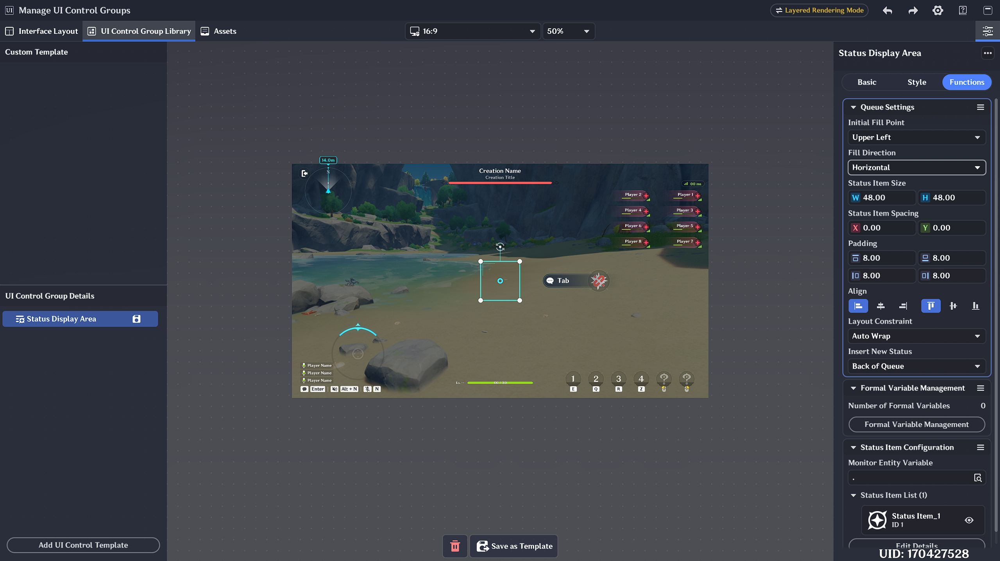
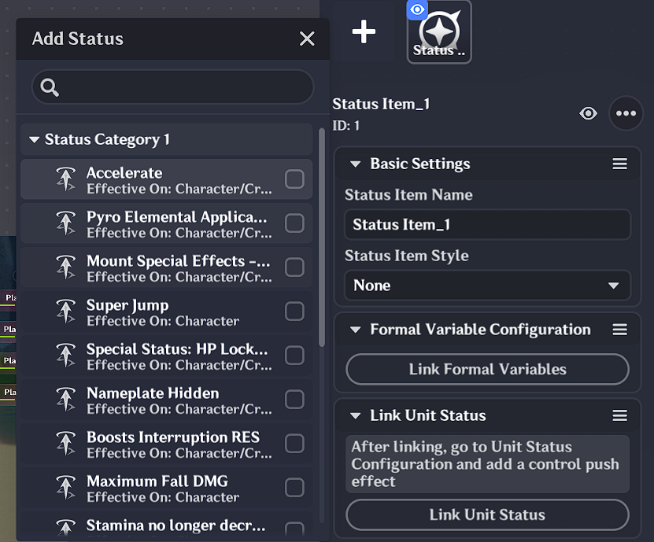
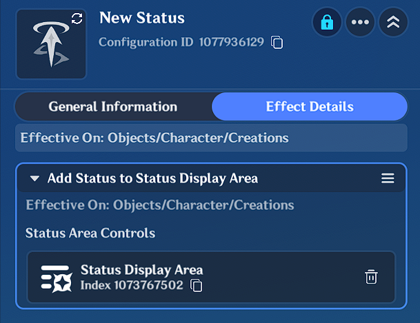

# Status Display Area Controls

## I. Features of the Status Display Area

The *Status Display Area* can be configured in a UI layout. It monitors unit statuses on entities and displays them in a custom style.

- The Status Display Area control is for **information display only** and cannot be interacted with.
- Unlike the Notification Queue, status items do **not** play additional animation effects when they are added or removed from the queue.

## II. Editing the Status Display Area

### 1. Adding the Status Display Area

In the *UI Control Group Editing Window*, add a UI control template — **Status Display Area**.

### 2. Status Item Style Settings

Similar to Tab Controls and Single-Choice Viewport Controls, the style of status items can be customized in the style settings.

Craftspeople can click **[Detail Edit]** to add any asset to the status item's Asset Group. For example, you can add a UI animation so that every time a new status item is added to the display area, the animation plays to indicate the status update.

### 3. Status Display Area Function Settings

- **Initial Fill Point**: The initial fill position when the first status item is added to the queue.
- **Fill Direction**: The direction in which status items are filled.
- **New Status Insertion Position**: Can be combined with **Fill Direction** and **Initial Fill Point** to achieve different effects.
  
  **Example** (when Layout Limit = Auto Wrap):
  - Initial Fill Point = Top-Left, Fill Direction = Vertical, New Status Insertion = End of Queue → items fill top to bottom.
  - Initial Fill Point = Bottom-Left, Fill Direction = Vertical, New Status Insertion = Start of Queue → items fill bottom to top.

- **Alignment**: Similar to text box alignment. Sets the alignment of all status items relative to their parent control (top/bottom/left/right).

### 4. Notes

Unlike the Notification Queue control, the **Layout Limit** parameter of the Status Display Area is affected by the fill direction:

- **Layout Limit = Fixed Rows**: Status items fill the current column first, then wrap to a new column.
- **Layout Limit = Fixed Columns**: Status items fill the current row first, then wrap to a new row.

## III. Steps to Display Status Items in the Status Display Area

All three of the following conditions must be met simultaneously for a status item to be displayed:

### 1. Determine the Monitored Entity

In the **Status Item Configuration** under the **Function** tab, first specify the entity to monitor.

### 2. Associate a Unit Status

Click **Edit Details** to open the interface, then click **[Link Unit Status]** to select the unit status to display.

### 3. Add a Control Push Effect to the Unit Status

For each unit status that should be displayed in the control, add a **"Add status to Status Display Area"** effect in its configuration, and select the target control to push to.
