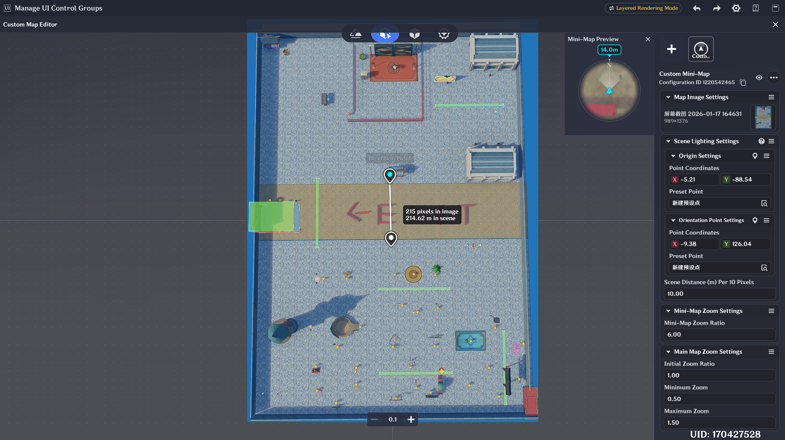
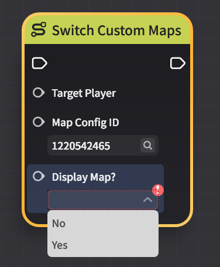

# Custom Mini-Map Controls

## I. Features of the Custom Mini-Map

The custom mini-map allows Craftspeople to upload custom map images based on the gameplay requirements of the stage, and switch the mini-map displayed to each player via nodes.

The correspondence between the map image and the actual stage scene (size, orientation, and position) can be customized.

The custom mini-map supports displaying all markers defined in the Mini-Map Marker component.

## II. Custom Mini-Map Management

Open the mini-map editing panel via **[UI Control Group Management] → [Intrinsic Content] → [Mini-Map]**.

- **Initial Visibility**: Determines whether the player using the current UI layout will see the mini-map.
- **Show Own View Range**: Determines whether the player using the current UI layout will see the distance value displayed above the mini-map.
- **Initially Active Map**: Selects the default active mini-map for the player using the corresponding UI layout. Note that switching a player's UI layout does **not** simultaneously switch their active mini-map.

## III. Custom Mini-Map Editing

### 1. Adding a Custom Mini-Map

Open the custom map editing panel via **[Edit Map]**, then click the "+" button to create a new custom map.

### 2. Uploading a Custom Image

Click **[Select Map Image]** to open the **[Map Image Asset Manager]**, where players can upload and select the image they wish to use.

### 3. Mapping the Custom Image to the Stage Scene

**Origin Setup:**

- **Origin Point Coordinates**: The point at which the image and scene are perfectly aligned; used to fix the image's position.
  - Enter the origin coordinates in the image, then align them with the corresponding preset point in the scene.

**Direction Point Setup:**

- **Direction Point Coordinates**: Used to determine the mapping direction between the image and the scene.
  - Enter the direction point coordinates in the image, then align them with the corresponding preset point in the scene.

After configuring the origin and direction point, the anchor and rotation mapping between image and scene is established. Only the scene's XZ axes mapped to the image's XY plane are considered — the Y axis is ignored.

> **Note:** The direction point only handles the image's forward orientation and does not calculate scale ratio.

**10 Pixels Corresponds to Scene Distance (m):**

The map scale that determines the scale ratio between the image and the scene. Craftspeople can calculate this value based on the scene size and the custom image size.

### 4. Map Display Configuration

**Mini-Map Scale:**

An existing configuration parameter. Determines the default zoom multiplier for the mini-map in the UI layout.

**Full Map Zoom Configuration:**

These settings affect the adjustable zoom range when the map is displayed as a full-screen M-key map. The minimum value is 0.1, the maximum is 2, and the adjustment granularity is 0.1.

The zoomed map can be previewed using the scale preview below.

### 5. Switching the Custom Mini-Map

**Server Node: Switch Custom Map**

Used to switch the mini-map displayed in the mini-map component within the UI layout of the target player and apply the related configuration.

- **Show Map**: If `true`, the map is shown; if `false`, the map is hidden (same effect as having no map configuration).
