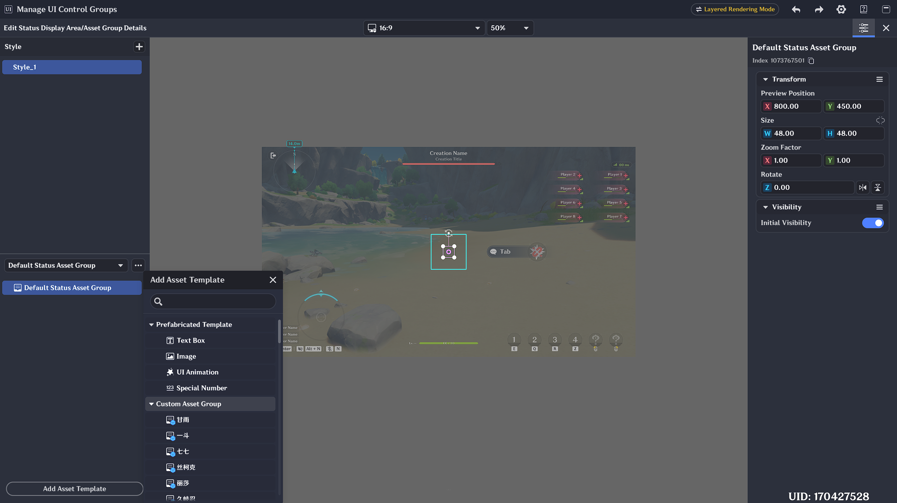
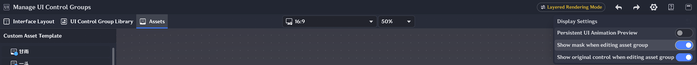

# Asset Library

## I. Definition of the Asset Library

In the *Asset Library*, Craftspeople can create multiple custom Asset Groups.

An **Asset Group** is data saved by combining and editing parameters for one or more UI control templates.

In UI controls that support Asset Group configuration, previously defined Asset Groups can be referenced to enrich the visual presentation of the control.

## II. Editing the Asset Library

### 1. Creating an Asset Group

Select the Asset Library and click **[Add Asset Template]** to add currently supported UI control templates to the asset details.

After adding templates, select any UI controls to combine. Click **[Create Asset Group]** to generate an Asset Group.

After creating the Asset Group, you can optionally enable a **Mask**. Enabling the mask allows a mask to be configured for that Asset Group.

> **Note:** Masks do not support special effects.

### 2. Referencing an Asset Group

Using the Status Display Area control as an example: in the reference asset area, an Asset Group can be referenced.

Click **[Edit Details]** to either create a new Asset Group or directly reference an already-created one.

### 3. Preview Settings During Asset Group Editing

After entering the Asset Group editing interface, the current Asset Group being edited is visually isolated from the canvas using a dimmed overlay. The position of the Asset Group on the canvas is for **editing preview purposes only** and does not affect the Asset Group's relative position based on its parent control.

In the settings, you can configure the visibility of the mask and the source control of the Asset Group during the editing preview.

